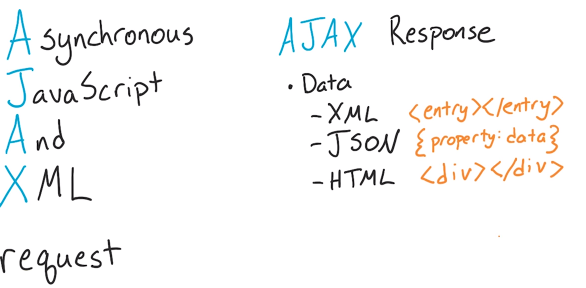
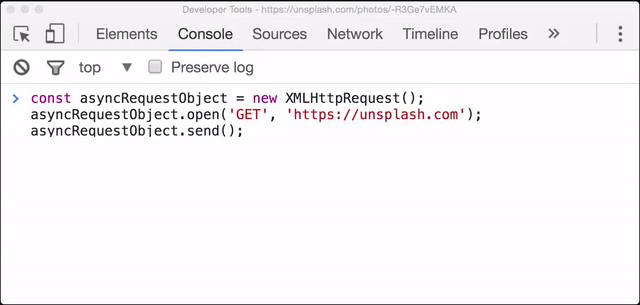
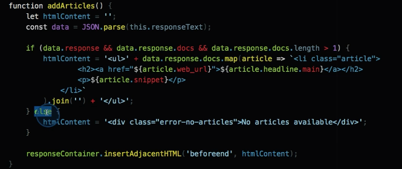

# Dynamic & Offline Capable Web Apps (due June 5th)

## 1. Ajax with XHR

1. Course Intro: You request a data async and then deal with it.

2. Client Server Demonstration

3. Ajax Definition & Examples



4. APIs

> Application Programming Interface

5. Create An Async Request with XHR

6. The XHR Object

7. XHR's .open() method

```javascript
asyncRequestObject.open();
//it takes a number of parameters but the most important are its first two: the HTTP method URL to send the request
// If we want to asynchronously request the homepage from the popular high-res image site, Unsplash, we'd use a GET request and provide the URL:
const asyncRequestObject = new XMLHttpRequest();
asyncRequestObject.open('GET', 'https://unsplash.com');
```
> Passing false as the third option makes the XHR request become a synchronous one. This will cause the JavaScript engine to pause and wait until the request is returned before continuing - this "pause and wait" is also called "blocking". This is a terrible idea and completely defeats the purpose for having an asynchronous behavior. Make sure you never set your XHR objects this way! Instead, either pass true as the 3rd argument or leave it blank (which makes it default to true).'

8. XHR's .send() method



> To handle the successful response of an XHR request, we set the onload property on the object to a function that will handle it: As with onload, if onerror isn't set and an error occurs, that error will just fail silently and your code (and your user!) won't have any idea what's wrong or any way to recover."

NEXT

```javascript
function handleSuccess () {
    // in the function, the `this` value is the XHR object
    // this.responseText holds the response from the server

    console.log( this.responseText ); // the HTML of https://unsplash.com/
}
asyncRequestObject.onload = handleSuccess;

function handleError () {
    // in the function, the `this` value is the XHR object
    console.log( 'An error occurred 😞' );
}

asyncRequestObject.onerror = handleError;
```

9. A Full Request

```javascript
function handleSuccess () { 
  console.log( this.responseText ); 
// the HTML of https://unsplash.com/}
function handleError () { 
  console.log( 'An error occurred \uD83D\uDE1E' );
}
const asyncRequestObject = new XMLHttpRequest();
asyncRequestObject.open('GET', 'https://unsplash.com');
asyncRequestObject.onload = handleSuccess;
asyncRequestObject.onerror = handleError;
asyncRequestObject.send();

// tweak the function to handle the response
function handleSuccess () {
const data = JSON.parse( this.responseText ); // convert data from JSON to a JavaScript object
console.log( data );
}
asyncRequestObject.onload = handleSuccess;
```

10. Project Initial Walkthrough

11. Setting a Request Header




```javascript 
const searchedForText = 'hippos';
const unsplashRequest = new XMLHttpRequest();

unsplashRequest.open('GET', `https://api.unsplash.com/search/photos?page=1&query=${searchedForText}`);
unsplashRequest.onload = addImage;
unsplashRequest.setRequestHeader('Authorization', 'Client-ID <your-client-id>');
unsplashRequest.send();

function addImage(){
}
```
12. Project Final Walkthrough

13. XHR Recap

```
To Send An Async Request
create an XHR object with the XMLHttpRequest constructor function
use the .open() method - set the HTTP method and the URL of the resource to be fetched
set the .onload property - set this to a function that will run upon a successful fetch
set the .onerror property - set this to a function that will run when an error occurs
use the .send() method - send the request
To Use The Response
use the .responseText property - holds the text of the async request's response
```

14. XHR Outro


## 2 Ajax with jQuery
In this lesson, you'll compare using XHR with using jQuery's Ajax method. You'll send and receive data using jQuery's Ajax methods and learn how jQuery's Ajax works under the hood.

## 3. Ajax with Fetch
In this lesson, you'll use JavaScript Promises to create a fetch request and handle the returned data asynchronously. You'll also learn how to handle errors for failed requests.

## 4. Syntax

## 5. Functions

## 6. Built-ins

## 7. Professional Developer-fu
With this massive improvement, not all browsers are able to support this new version of JavaScript. In this lesson, you'll learn about using polyfills and transpiling your ES6 JavaScript code to ES5.

## 8. IndexedDB and Caching

## 9. Introducing Web Tooling and Automation
Learn how automation and tooling can make you more productive as a developer and allow you to work more faster and more efficiently.

## 10. Productive Editing
Use keyboard shortcuts and code editor extensions to speed up your development process and help to avoid repetitive typing tasks.

## 11. Powerful Builds
Leverage the power of build tools like Gulp and Grunt to automate the process of converting your development code into streamlined production-ready code.

## 12. Expressive Live Editing
Learn how to set up your environment for live editing. Live editing will cause any connected browser to automatically reload if you change any file it's watching in your project.

## 13. How to Prevent Disasters
Learn how to use tooling to be a safety net for you as you're coding. Use it to automatically check the code you write and automatically run tests.

## 14. Awesome Optimizations
Learn how to use tooling to optimize your apps for production use. You'll learn how to concatenate, minify, and optimize your code.

## 15. Web Tooling and Automation Conclusion
You're on your way to tooling greatness. In this lesson, you'll learn about tooling to scaffold entire projects.

## PROJECT - Restaurant Reviews App — Stage 2
Build off of your existing Restaurant Reviews app to create a fully-featured app that communicates with a backend server and handles asynchronous requests.
